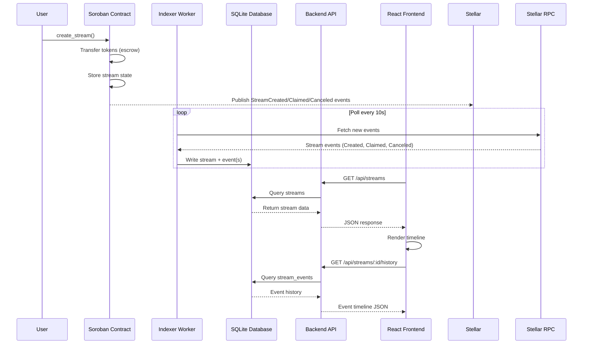
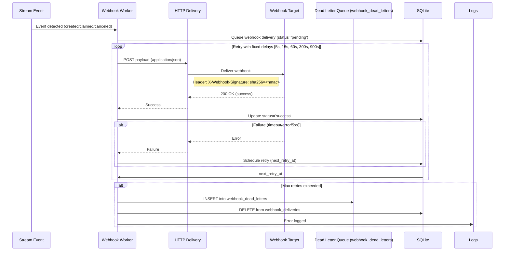
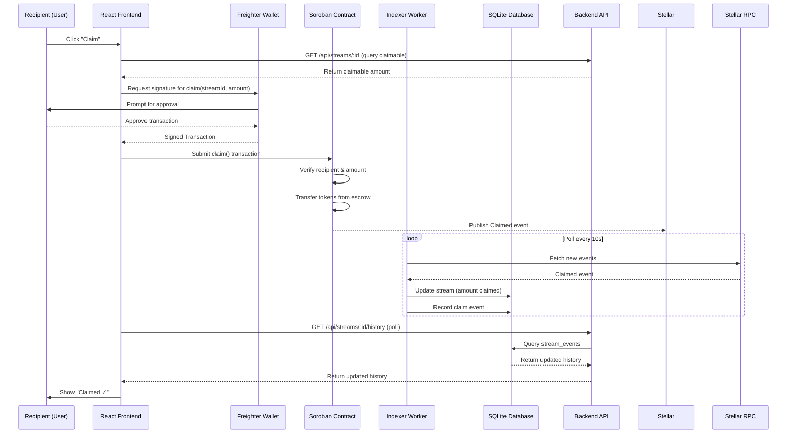

# StellarStream

StellarStream is a basic payment-streaming MVP for the Stellar ecosystem.

It includes:

- A React dashboard to create and monitor streams
- A Node.js/Express API for stream lifecycle operations
- A Soroban smart contract scaffold for on-chain stream logic
- A backlog folder with implementation task drafts

This repository is intentionally lightweight and easy to extend.

For common questions and troubleshooting, see our [FAQ.md](FAQ.md).  
For production setup and operations, see [DEPLOYMENT.md](DEPLOYMENT.md) and [RUNBOOK.md](RUNBOOK.md).  
For security policy and reporting vulnerabilities, see [SECURITY.md](SECURITY.md).  
We are committed to a welcoming environment; see our [CODE_OF_CONDUCT.md](CODE_OF_CONDUCT.md).

## 1) What The Project Does

StellarStream models a payment stream where a sender allocates a total amount over a fixed duration.  
As time passes, the recipient "vests" value continuously.

Current MVP behavior:

- Create stream
- List streams with live progress
- Cancel stream
- Show computed metrics (active/completed/vested)
- Track and display event history for stream lifecycle actions

## 2) Current Architecture

Frontend (`frontend`, port `3000`)

- React + Vite app
- Uses `/api` proxy to call backend
- Polls stream list every 5 seconds

Backend (`backend`, port `3001`)

- Express REST API
- SQLite database for persistent storage
- Event indexer worker for tracking stream lifecycle
- Computes progress in real time from timestamps

Contract (`contracts`)

- Soroban contract scaffold in Rust
- Supports `create_stream`, `claimable`, `claim`, and `cancel`
- Not yet integrated with backend runtime in this MVP

See also: [Event Flow](#event-flow) for detailed sequence diagrams of the contract-to-frontend pipeline and webhook delivery system.

## Event Flow

### On-Chain Event Pipeline

The following sequence diagram shows how events flow from the Soroban contract through the indexing pipeline to the frontend:



### Webhook Delivery Pipeline

Events from the stream lifecycle are also delivered via HTTP webhooks with retry and dead-letter handling:



### Claim Flow Pipeline

The following diagram details the full claim lifecycle, from UI interaction to on-chain execution and backend reconciliation:



## 3) Stream Math Model

For each stream:

- `totalAmount`
- `startAt`
- `durationSeconds`
- `end = startAt + durationSeconds`

At time `t`:

- `elapsed = clamp(t - startAt, 0, durationSeconds)`
- `ratio = elapsed / durationSeconds`
- `vested = totalAmount * ratio`
- `remaining = totalAmount - vested`

Status rules:

- `scheduled` when `t < startAt`
- `active` when `startAt <= t < end`
- `completed` when `t >= end`
- `canceled` when stream was canceled

## 4) API Reference

Base URL:

- Local: `http://localhost:3001`
- Frontend proxy: `/api`

### `GET /api/health`

Purpose:

- Service health check

Response:

- `service`, `status`, `timestamp`

**Docker Compose Health Check Configuration:**

- **Interval:** 30s
- **Timeout:** 10s
- **Retries:** 3
- **Start Period:** 10s

### `GET /api/streams`

Purpose:

- List streams sorted by newest first, with optional filtering and pagination

Query params (optional):

- `status: scheduled | active | completed | canceled`
- `sender: string` (exact sender match)
- `recipient: string` (exact recipient match)
- `asset: string` (exact asset code match)
- `q: string` (general search term - searches stream ID, sender, recipient, and asset code, case-insensitive)
- `page: number` (integer `>= 1`)
- `limit: number` (integer `1..100`)

Search behavior:

- The `q` parameter performs case-insensitive partial matching across stream ID, sender, recipient, and asset code
- Search combines with other filters (all filters are applied together)
- Empty or whitespace-only search terms are ignored

Pagination behavior:

- If both `page` and `limit` are omitted, legacy mode applies and all matching rows are returned.
- If either `page` or `limit` is provided, pagination mode applies with defaults `page=1` and `limit=20`.

Validation:

- Invalid `status`, `page`, or `limit` returns `400`.

Response:

- `data: Stream[]` (includes computed `progress`)
- `total: number` (filtered count before pagination)
- `page: number` (applied page)
- `limit: number` (applied page size)

### `GET /api/streams/:id`

Purpose:

- Fetch single stream by ID

Response:

- `data: Stream`

Error:

- `404` if stream does not exist

### `GET /api/recipients/:accountId/streams`

Purpose:

- Fetch all streams for a specific recipient account

Path parameters:

- `accountId: string` (Stellar account ID starting with G, exactly 56 characters)

Validation:

- Account ID must be a valid Stellar account ID format

Response:

- `data: Stream[]` (includes computed `progress` for each stream)

Error:

- `400` if account ID is invalid

### `GET /api/assets`

Purpose:

- Fetch the current allowed asset allowlist

Response:

- `data: string[]` (normalized asset codes)

### `POST /api/streams`

Purpose:

- Create a new stream

Request JSON:

- `sender: string`
- `recipient: string`
- `assetCode: string`
- `totalAmount: number`
- `durationSeconds: number` (minimum 60)
- `startAt?: number` (unix seconds)

Validation:

- Sender/recipient must be non-trivial strings
- Asset length must be 2..12
- Amount must be positive
- Duration must be at least 60 seconds

Response:

- `201` with `data: Stream`

### `POST /api/streams/:id/cancel`

Purpose:

- Cancel an existing stream

Response:

- `data: Stream` with canceled state

Error:

- `404` if stream does not exist

### `GET /api/open-issues`

Purpose:

- Returns implementation backlog items shown in UI

Response:

- `data: OpenIssue[]`

### `GET /api/streams/:id/history`

Purpose:

- Fetch event history timeline for a specific stream

Response:

- `data: StreamEvent[]` (ordered by timestamp ascending)

Event types:

- `created`: Stream was created
- `claimed`: Tokens were claimed from the stream
- `canceled`: Stream was canceled
- `start_time_updated`: Start time was modified

Each event includes:

- `id`: Event ID
- `streamId`: Associated stream ID
- `eventType`: Type of event
- `timestamp`: Unix timestamp when event occurred
- `actor`: Account that triggered the event (optional)
- `amount`: Amount involved (optional, for created/claimed)
- `metadata`: Additional context (optional)

## 5) Smart Contract (Soroban) Behavior

Contract file:

- `contracts/src/lib.rs`

Data:

- `NextStreamId`
- `Stream(stream_id) -> Stream`

Implemented methods:

- `create_stream(...) -> u64`
- `get_stream(stream_id) -> Stream`
- `claimable(stream_id, at_time) -> i128`
- `claim(stream_id, recipient, amount) -> i128`
- `cancel(stream_id, sender)`

Important note:

- `claim` currently updates accounting only.
- Token transfer wiring is planned as next implementation step.

## 6) Run Locally

Prerequisites:

- Node.js 18+
- npm 9+
- Optional for contract work: Rust + Soroban toolchain

### Option A: Direct npm (Recommended for Development)

From repo root:

```bash
npm run install:all
npm run dev:backend
npm run dev:frontend
```

Manual alternative:

```bash
cd backend && npm install && npm run dev
cd frontend && npm install && npm run dev
```

Open:

- Frontend: `http://localhost:3000`
- Backend: `http://localhost:3001`

### Option B: Docker Compose with Hot-Reload

For local development with Docker, use the `docker-compose.override.yml` file which automatically mounts source directories and enables hot-reload:

```bash
docker-compose up
```

The override file:

- Mounts `./backend/src` and `./frontend/src` into containers for live code changes
- Runs `npm run dev` for both services (ts-node-dev for backend, Vite for frontend)
- Exposes Vite HMR port (5173) for frontend hot module replacement
- Sets `NODE_ENV=development` for the backend

**Features:**

- Backend hot-reload: Changes to `backend/src/**` trigger automatic restart via ts-node-dev
- Frontend hot-reload: Changes to `frontend/src/**` trigger Vite HMR
- Database persists across restarts (mounted volume)
- No need to rebuild images when code changes

**Ports:**

- Frontend: `http://localhost:3000`
- Backend: `http://localhost:3001`
- Vite HMR: `localhost:5173` (automatic, used by frontend)

Build:

```bash
npm run build
```

## 7) Deploy Contract

Deploy the Soroban contract to Stellar testnet.

### Prerequisites

- [soroban-cli](https://soroban.stellar.org/docs/getting-started/setup#install-the-soroban-cli) installed
- Rust toolchain with `wasm32-unknown-unknown` target
- Stellar testnet account with secret key

### Deployment

Set the `SECRET_KEY` environment variable and run:

```bash
SECRET_KEY="S..." npm run deploy:contract
```

Or use the script directly:

```bash
SECRET_KEY="S..." ./scripts/deploy.sh
```

The script will:

1. Build the contract
2. Deploy to Stellar testnet
3. Output the contract ID
4. Save the contract ID to `contracts/contract_id.txt`

### Environment Variables for Deployment

**Required:**

- `SECRET_KEY` - Stellar account secret key for deployment (must have testnet XLM for fees)

**Optional:**

- `NETWORK_PASSPHRASE` - Network passphrase (defaults to testnet: `"Test SDF Network ; September 2015"`)
- `RPC_URL` - RPC endpoint URL (defaults to `https://soroban-testnet.stellar.org:443`)

### After Deployment

1. Copy the contract ID from the output or `contracts/contract_id.txt`
2. Set `CONTRACT_ID` in your backend `.env` file
3. Ensure `SERVER_PRIVATE_KEY` is set in your backend `.env` file
4. Restart your backend service

## 8) Environment And Config

Copy `backend/.env.example` to `backend/.env` and fill in the values before starting the server.

The backend validates all environment variables **at startup**. If a required variable is missing or malformed, the process exits immediately with a descriptive error message rather than failing silently at runtime.

### Database

StellarStream uses **SQLite** for persistent storage. See [ADR 0001: SQLite vs PostgreSQL](docs/adr/0001-sqlite-storage.md) for the design rationale, migration path to PostgreSQL, and performance considerations.

### Soroban / On-chain mode vs. local-only mode

| Mode                          | When to use                                                    | How to enable                              |
| ----------------------------- | -------------------------------------------------------------- | ------------------------------------------ |
| **Soroban enabled** (default) | Full on-chain integration — contract deployed, indexer running | Set `CONTRACT_ID` and `SERVER_PRIVATE_KEY` |
| **Soroban disabled**          | Local UI/API development without a deployed contract           | Set `SOROBAN_DISABLED=true`                |

> ⚠️ `SOROBAN_DISABLED=true` is for local development only. Never set it in production or staging.

### Backend variables

| Variable                    | Required                                 | Default                                   | Description                                                             |
| --------------------------- | ---------------------------------------- | ----------------------------------------- | ----------------------------------------------------------------------- |
| `SOROBAN_DISABLED`          | No                                       | `false`                                   | Set to `"true"` to skip Soroban checks and run off-chain                |
| `CONTRACT_ID`               | **Yes** (unless `SOROBAN_DISABLED=true`) | —                                         | Soroban contract ID from deployment (56 chars, starts with `C`)         |
| `SERVER_PRIVATE_KEY`        | **Yes** (unless `SOROBAN_DISABLED=true`) | —                                         | Stellar secret key for signing transactions (56 chars, starts with `S`) |
| `PORT`                      | No                                       | `3001`                                    | Port the Express API listens on                                         |
| `RPC_URL`                   | No                                       | `https://soroban-testnet.stellar.org:443` | Soroban RPC endpoint                                                    |
| `NETWORK_PASSPHRASE`        | No                                       | `Test SDF Network ; September 2015`       | Stellar network passphrase                                              |
| `ALLOWED_ASSETS`            | No                                       | `USDC,XLM`                                | Comma-separated list of allowed asset codes                             |
| `DB_PATH`                   | No                                       | `backend/data/streams.db`                 | Path to the SQLite database file                                        |
| `WEBHOOK_DESTINATION_URL`   | No                                       | —                                         | HTTP(S) URL for stream lifecycle webhook delivery                       |
| `WEBHOOK_SIGNING_SECRET`    | No                                       | —                                         | Secret for HMAC-SHA256 webhook payload signing                          |
| `AUTH_CHALLENGE_RATE_LIMIT` | No                                       | `10`                                      | Rate limit for auth challenge endpoint (requests per minute)            |
| `READ_RATE_LIMIT`           | No                                       | `120`                                     | Rate limit for read endpoints (requests per minute per IP)              |
| `MUTATION_RATE_LIMIT`       | No                                       | `10`                                      | Rate limit for mutation endpoints (requests per minute per IP)          |

### Frontend variables

| Variable       | Required | Default | Description          |
| -------------- | -------- | ------- | -------------------- |
| `VITE_API_URL` | No       | `/api`  | Backend API base URL |

### Webhook signing

- Header: `X-StellarStream-Signature`
- Format: `sha256=<hex-digest>`
- Digest input: raw JSON request body string
- Algorithm: HMAC-SHA256 using `WEBHOOK_SIGNING_SECRET`

To verify a delivery, compute `sha256=` + HMAC-SHA256 of the raw request body using your `WEBHOOK_SIGNING_SECRET` and compare it to the `X-StellarStream-Signature` header value using a constant-time comparison.

Example (Node.js):

```js
const { createHmac, timingSafeEqual } = require("crypto");
const expected =
  "sha256=" + createHmac("sha256", secret).update(rawBody).digest("hex");
const received = req.headers["x-stellarstream-signature"];
const valid = timingSafeEqual(Buffer.from(expected), Buffer.from(received));
```

If `WEBHOOK_DESTINATION_URL` is set without `WEBHOOK_SIGNING_SECRET`, webhooks are delivered unsigned and a warning is logged at startup.

### Rate limiting

The API implements per-IP rate limiting on read and mutation endpoints:

**Read endpoints** (120 requests/minute per IP):

- `GET /api/streams`
- `GET /api/streams/:id`
- `GET /api/streams/:id/history`
- `GET /api/streams/:id/snapshot`
- `GET /api/recipients/:accountId/streams`
- `GET /api/senders/:accountId/streams`
- `GET /api/events`
- `GET /api/streams/export.csv`

**Mutation endpoints** (10 requests/minute per IP):

- `POST /api/streams` (create)
- `POST /api/streams/:id/cancel` (cancel)
- `POST /api/streams/:id/pause` (pause)
- `POST /api/streams/:id/resume` (resume)
- `POST /api/streams/:id/claim` (claim)

When a rate limit is exceeded, the API returns:

- **Status:** `429 Too Many Requests`
- **Header:** `Retry-After: <seconds>` (time until limit resets)
- **Body:** Error response with `code: "RATE_LIMIT_EXCEEDED"`

Limits are configurable via environment variables:

- `READ_RATE_LIMIT` (default: 120 requests/minute)
- `MUTATION_RATE_LIMIT` (default: 10 requests/minute)
- `AUTH_CHALLENGE_RATE_LIMIT` (default: 10 requests/minute)

### Startup validation behaviour

The server validates config before doing anything else:

- **Missing `CONTRACT_ID` or `SERVER_PRIVATE_KEY`** (Soroban enabled) → exits with a message explaining how to deploy the contract and where to set the value.
- **Malformed `CONTRACT_ID`** (not 56 chars / not starting with `C`) → exits with a format hint.
- **Malformed `SERVER_PRIVATE_KEY`** (not 56 chars / not starting with `S`) → exits with a format hint.
- **Invalid `RPC_URL` or `WEBHOOK_DESTINATION_URL`** → exits with the bad value shown.
- **`SOROBAN_DISABLED=true`** → logs a notice and skips all Soroban checks; the event indexer does not start.

See `backend/src/config/validateEnv.ts` for the full validation logic.

## 9) Project File Map

Root:

- `.gitignore`: ignore rules for Node/Rust/local files.
- `package.json`: root helper scripts (install/build/dev delegates).
- `README.md`: project documentation.

GitHub templates:

- `.github/ISSUE_TEMPLATE/config.yml`: issue template behavior.
- `.github/ISSUE_TEMPLATE/project-task.md`: reusable issue template file.

Scripts:

- `scripts/deploy.sh`: builds and deploys the Soroban contract to testnet.
- `scripts/generate-contract-bindings.sh`: generates TypeScript bindings from a deployed contract.

Docs:

- `docs/CONTRACT_BINDINGS.md`: full workflow for generating and consuming contract bindings.

Backend:

- `backend/package.json`: backend dependencies and scripts.
- `backend/tsconfig.json`: backend TypeScript compiler config.
- `backend/src/index.ts`: API server, route handlers, request validation.
- `backend/src/config/validateEnv.ts`: startup environment variable validation.
- `backend/src/services/streamStore.ts`: stream store + progress math + Soroban integration.
- `backend/src/services/db.ts`: SQLite database initialization and schema.
- `backend/src/services/eventHistory.ts`: event recording and retrieval functions.
- `backend/src/services/indexer.ts`: background worker for indexing contract events.
- `backend/src/services/auth.ts`: authentication middleware and JWT handling.
- `backend/src/services/openIssues.ts`: backlog entries returned by API.

Frontend:

- `frontend/index.html`: Vite HTML entry.
- `frontend/package.json`: frontend dependencies and scripts.
- `frontend/postcss.config.js`: PostCSS plugin config.
- `frontend/tailwind.config.js`: Tailwind config (kept for styling extension).
- `frontend/tsconfig.json`: frontend TypeScript config.
- `frontend/tsconfig.node.json`: TS config for Vite/node-side files.
- `frontend/vite.config.ts`: dev server config + backend API proxy.
- `frontend/src/main.tsx`: React app bootstrap.
- `frontend/src/App.tsx`: top-level layout, polling, metrics, handlers.
- `frontend/src/index.css`: app styles.
- `frontend/src/services/api.ts`: typed API client functions.
- `frontend/src/services/contractClient.ts `: thin wrapper around generated contract client.
- `frontend/src/contracts/generated/`: gitignored — TypeScript bindings generated by npm run gen:bindings.
- `frontend/src/types/stream.ts`: shared frontend data types.
- `frontend/src/components/CreateStreamForm.tsx`: stream creation form.
- `frontend/src/components/StreamsTable.tsx`: stream list and cancel actions.
- `frontend/src/components/StreamTimeline.tsx`: event history timeline display.
- `frontend/src/components/IssueBacklog.tsx`: backlog panel renderer.

Contract:

- `contracts/Cargo.toml`: Rust crate and Soroban dependency config.
- `contracts/src/lib.rs`: Soroban contract implementation scaffold.

## 10) Known Limitations

- Contract is not fully connected to backend execution path yet.
- Wallet sign/transaction flow is not active yet in UI.
- No authentication layer on write endpoints.
- Test coverage and CI can be expanded.
- Event indexer polls every 10 seconds (configurable).
- Contract bindings `(frontend/src/contracts/generated/)` must be regenerated locally after each deployment.

## 11) Suggested Next Steps

- Move stream source of truth from memory to Soroban state.
- Add wallet-authenticated transaction signing flow.
- Wire `frontend/src/services/contractClient.ts` using generated bindings to call create_stream, claim, and cancel directly from the frontend.
- Add contract tests and backend integration tests.
- Enhance event history with claim events from contract.
- Add real-time event notifications via WebSockets.
- Automate binding regeneration in CI after each contract deployment.
